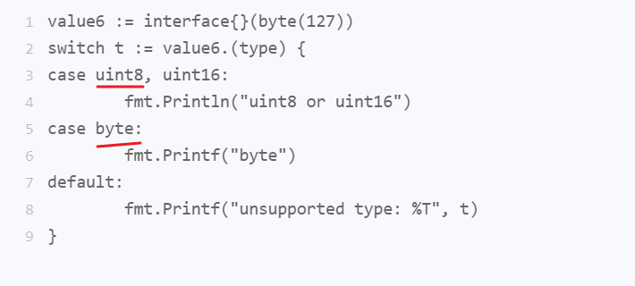

# golang-strudy
## for range细节
range关键字是Go语言中一个非常有用的迭代array，slice，map, string, channel中元素的内置关键字。
- 使用方式`for xxx := range [range表达式]`
    - 这里用[range表达式]用来方便说明
    - 1 range表达式只会在for语句开始执行时被求值一次，无论后边会有多少次迭代
    - 2 range表达式的求值结果会被复制，也就是说，被迭代的对象是range表达式结果值的副本而不是原值。如果是指针/引用类型，得到的副本是对应的指针副本，否则则是新的拷贝
    > 这样就会造成，range过程中，slice变长时，e得到的值范围不会增加
    > range过程中，数组内部变化，e得到的值不会改变
    - 3 对于channel，range会求值多次，毕竟channel本身就是变化的
    > 就是说，range会在内部保存一个range表达式的副本，它会遍历这个副本，对外是透明的。
```golang
func test1() {
	// 示例2。
	// 值类型，range第一次就确认了e的值，且是拷贝的副本，及e的值
	// 只能是1，2，3，4，5，6
	numbers2 := [...]int{1, 2, 3, 4, 5, 6}
	maxIndex2 := len(numbers2) - 1

	// e 的值已经在for range 开始时，就已经确定为 1 2 3 4 5 6
	// 因为range 的是numbers2的副本，而numbers是数组
	for i, e := range numbers2 {
		if i == maxIndex2 {
			numbers2[0] += e
		} else {
			numbers2[i+1] += e // 改变下一下标的值，但range下次遍历时，e是改变前的值
		}
	}
	fmt.Println(numbers2) // [7 3 5 7 9 11] 即 [1+6, 1+2, 2+3, 3+4, 4+5, 5+6]
	fmt.Println()
}

func test2() {
	// 示例2。
	// 引用类型，e得到的是每个位置的指针/引用，故slic中的值变化，迭代到时
	// e的值相应变化
	numbers2 := []int{1, 2, 3, 4, 5, 6}
	maxIndex2 := len(numbers2) - 1

	// 表达式的值已经在for range 开始时，就已经确定为numbers 切片的副本
	// 因为range 的是numbers2的副本，而numbers是切片，则在里面改变，会影响到源切片
	// 可以理解为，range 会拿到numbers2_副本，我们在外看到的numbers2还是原来哪一个，但在range
	// 实现的内部，它会遍历numbers2_副本，而这个副本对我们是透明的
	for i, e := range numbers2 {
		if i == maxIndex2 {
			numbers2[0] += e
		} else {
			numbers2[i+1] += e // 改变下一下标的值，但range下次遍历时，e是改变前的值
		}
	}
	fmt.Println(numbers2) // [7 3 5 7 9 11] 即 [1+6, 1+2, 2+3, 3+4, 4+5, 5+6]
	fmt.Println()
}
```
## switch中的细节
- 1，switch表达式结果、case表达式结果的类型要一致
    - switch语句会进行有限的类型转换
    - 若是无类型的常量，如4，switch语句会这个常量会被自动地转换为此种常量的默认类型的值，int 4
- 2，不同case间一般不能有重叠，如果有重叠，会按照`先上后下的顺序`，执行上面的case，而不执行下面的case
- 3，switch 用于类型判断，则必须要直接由类型字面量表示，而无法通过间接的方式表示

图中 uint8是byte的别名，他们的字面量是一样的，因此不能通过编译
