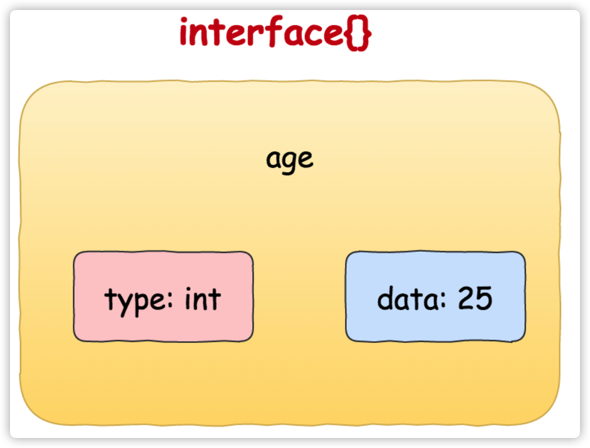
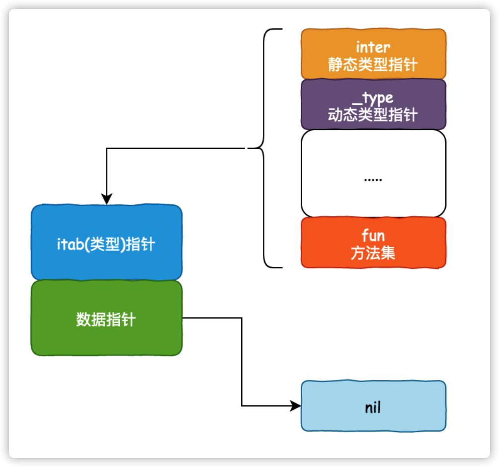
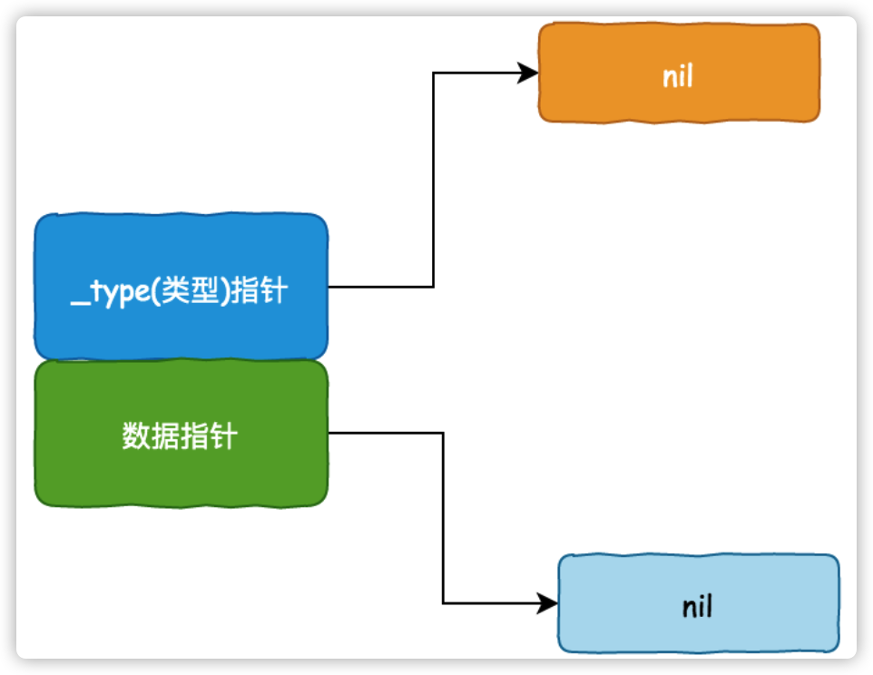
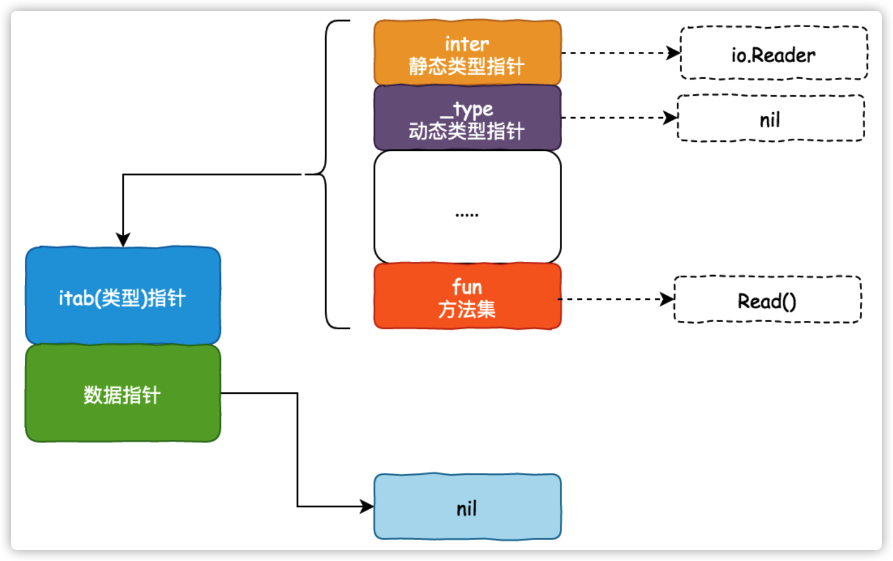
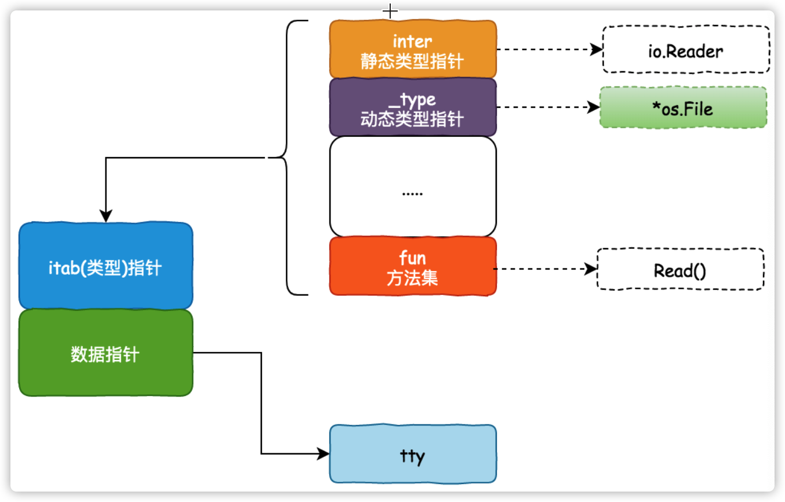
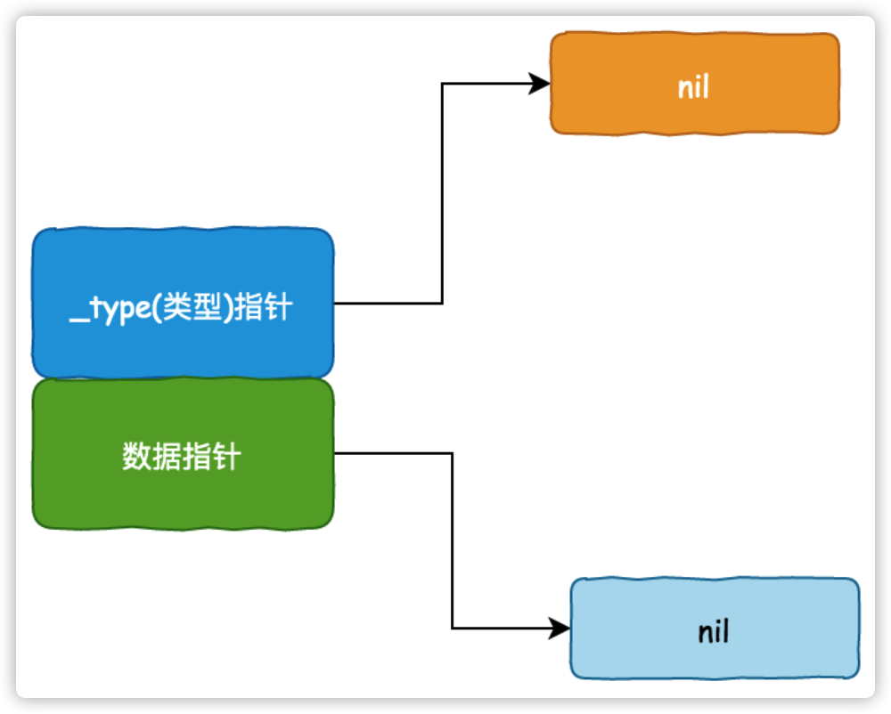
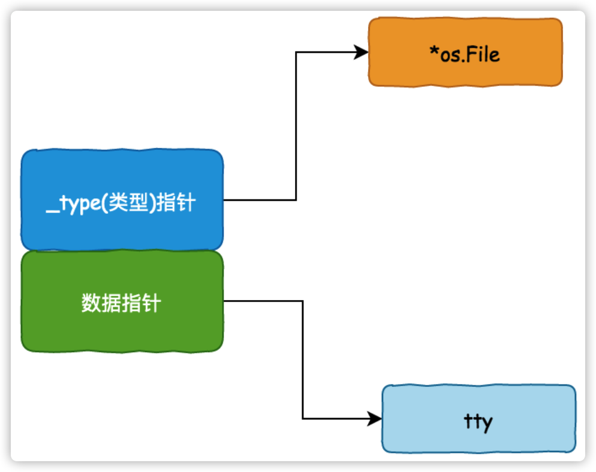

# 静态与动态类型
## 1. 静态类型
golang是强类型语言，变量类型在声明时就已经确定，不会改变
```golang
var a int // a 的静态类型是 int
var s string // s 的静态类型是 string
var i interface{} // i 的静态类型是 interface{}
```
## 2. 动态类型
运行时才能决定的类型，一般针对的是接口类型，如空接口`interface{}`，被赋值后才知道里面是什么类型的数据
```golang
var i interface{} // i的静态类型为 interface{}
i = 18 // 此时i的动态类型为 int
i = "Curricane" // 此时i的动态类型为 string
```
## 接口组成
每一个接口变量都可以看做是一对pair(type, data)组合而成的，pair对中记录着实际变量的值和类型。
```golang
var age int = 25
```

```golang
age := (interface{})(25)
fmt.Printf("type: %T, data: %v\n", age, age) // type: int, data: 25
var i interface{}
fmt.Printf("type: %T, data: %v\n", i, i) // type: <nil>, data: <nil>
// 如此看来，%T打印的是 动态类型
```
## 接口具体实现
根据接口是否包含方法，可以将接口分为`iface`和`eface`
### 1. `iface`
`iface`表示带有一组方法的接口
- `iface`源码如下
```golang
// runtime/runtime2.go
// 非空接口
type iface struct {
    tab  *itab
    data unsafe.Pointer
}
 
// 非空接口的类型信息
type itab struct {
    inter  *interfacetype  // 接口定义的类型信息
    _type  *_type      // 接口实际指向值的类型信息
    link   *itab  
    bad    int32
    inhash int32
    fun    [1]uintptr   // 接口方法实现列表，即函数地址列表，按字典序排序
}

// runtime/type.go
// 非空接口类型，接口定义，包路径等。
type interfacetype struct {
   typ     _type
   pkgpath name
   mhdr    []imethod      // 接口方法声明列表，按字典序排序
}
// 接口的方法声明 
type imethod struct {
   name nameOff          // 方法名
   ityp typeOff                // 描述方法参数返回值等细节
}
```
- `iface`接口图

### 2. eface
`eface`，表示不带有方法的接口，如`var i interface`
- `eface`源码如下
```golang
// src/runtime/runtime2.go
// 空接口
type eface struct {
    _type *_type
    data  unsafe.Pointer
```
- `eface`结构图

## 理解动态类型
接口在声明时确定静态类型，data为nil；在赋值后，确定动态类型，data指向具体的值内存
### iface
```golang
var reader io.Reader
tty, err := os.OpenFile("/dev/tty", os.O_RDWR, 0)
if err != nil {
    return nil, err
}
reader = tty
```
运行`var reader io.Reader`时，reader接口的内存结构如下图

当执行到`reader = tty`时，reader接口的内存结构如下图

### eface
```golang
//不带函数的interface
var empty interface{}

tty, err := os.OpenFile("/dev/tty", os.O_RDWR, 0)
if err != nil {
    return nil, err
}

empty = tty
```
第一行代码：`var empty interface{}`，由于`interface{}`是一个`eface`，其只有一个`_type`可以存放变量类型，此时`empty`对象的（静态）类型是`nil`.

最后一行代码：`empty = tty`,`tty`是一个`*os.File`类型的实例，此时`_type`变成了`*os.File`

## 接口与nil比较
一个interface{}类型的变量包含了2个指针，一个指针指向值的类型，另外一个指针指向实际的值；只有这两个指针都为nil，该接口才为nil  
举个例子
```golang
type State struct{}
 
func testnil1(a, b interface{}) bool {
	return a == b
}
func testnil2(a *State, b interface{}) bool {
	return a == b
}
func testnil3(a interface{}) bool {
	return a == nil
}
func testnil4(a *State) bool {
	return a == nil
}
func testnil5(a interface{}) bool {
	v := reflect.ValueOf(a)
	return !v.IsValid() || v.IsNil()
}
func main() {
	var a *State
	fmt.Println(testnil1(a, nil))
	fmt.Println(testnil2(a, nil))
	fmt.Println(testnil3(a))
	fmt.Println(testnil4(a))
	fmt.Println(testnil5(a))
}
```
其输出结果为
```golang
false
false
false
true
true
```
### 动态类型的意义
- 实现多态
- 增加程序的扩展性
